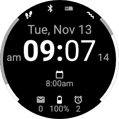

# Facey McWatchface

Looks something like this:

A _Garmin ConnectIQ_ watchface currently optimized for the following Garmin watches:

* vivoactive 3
* vivoactive 3 music

## Features

The watchface shows the following information:

* Date
* Time
* Steps
* Floors
* Bluetooth connection status
* Do Not Disturb status
* Time of next appointment (see below)
* Number of notifications
* Battery status
* Number of active watch alarms

## Appointments

The watchface is able to show the time of the upcoming appointment. Only appointments in the upcoming 24 hours (minus 5 minutes) are displayed. The whole thing only works if a companion app, _Calendar IQ Connector_, is installed on an Android mobile the watch is connected to. That app will send information on upcoming appointments to the watch in regular intervals.

## Attributions

This project stands on the shoulders of the following people:

- The [Crystal](https://apps.garmin.com/en-GB/apps/9fd04d09-8c80-4c81-9257-17cfa0f0081b) watchface ([GitHub repository](https://github.com/warmsound/crystal-face)).
- Eugen Belyakoff from the Noun Project, whose [Steps](https://thenounproject.com/term/steps/87667/) icon is used.
