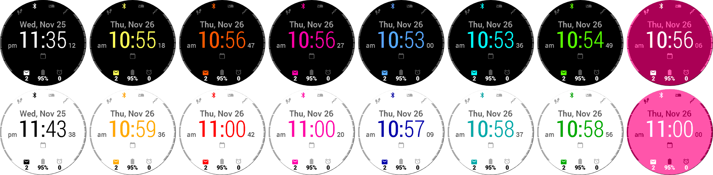

# Facey McWatchface

A watchface for Garmin smartwatches with a focus on communication. Looks something like this:

Facey McWatchface is available at the [Connect IQ Store](https://apps.garmin.com/en-US/apps/3c5eb9f4-0921-43a3-a5f1-12979a9aa3ce).

## Highlights

### Upcoming Appointment

Oh yes: The watchface is able to show the time of the upcoming appointment! Only appointments in the upcoming 24 hours (minus 5 minutes) are displayed. The whole thing only works if a companion app, [Calendar IQ Connector](https://github.com/le-cds/android-calendariq), is installed on an Android mobile the watch is connected to. That app will send information on upcoming appointments to the watch in regular intervals.

### On-Device Configuration

Tired of using external apps to configure your watch face? So am I, which is why Facey McWatchface has a configuration UI, similar to Garmin’s pre-installed watch faces. This, however, is only supported on newer devices, such as the vívoactive® 4 (I think), not on my personal watch. Had I known that before, I would have been like “Not on my watch, kind Sir!”, and I would have been right…

### Color Themes

Everyone supports color themes nowadays, so Facey McWatchface does, too!

## Things This Thing Shows

There are…

* …two indicators at the top that show symbols, but no text.
* …four indicators at the bottom that show symbols _and_ text, because that is how they roll.
* …two range meters at the left and the right.

All of them can be freely configured to show stuff, according to this helpful table:

| Thing                                                     |                      | Indicator | Meter |
| --------------------------------------------------------- | -------------------- | --------- | ----- |
|           | Active Alarms        | Yes       |       |
|    | Active minutes       |           | Yes   |
|         | Altitude             | Yes       |       |
|          | Battery Charge       | Yes       | Yes   |
|        | Bluetooth state      | Yes       |       |
|         | Calories (kCal)      | Yes       |       |
|         | Distance travelled   | Yes       |       |
|              | Do not Disturb       | Yes       |       |
|    | Floors climbed       | Yes       | Yes   |
|  | Floors descended     | Yes       |       |
|        | Heart rate           | Yes       |       |
|          | Move bar             |           | Yes   |
|     | Next appointment     | Yes       |       |
|            | Steps stepped        | Yes       | Yes   |
|    | Unread notifications | Yes       |       |

## Required permissions

* Run in the background

  If appointments are shown, the watchface regularly checks for messages sent by the accompanying Android app in the background. The only data transmitted are timestamps of upcoming appointments.

* Send/receive information to/from the internet

  Required to receive information from the accompanying Android app in the first place. No information are sent to or received from the internet.

## Supported Smartwatches

### Tested

I have either used the watchface myself on the following devices (successfully, I might add), or know of people who have:

* vívoactive® 3 (all variations)

### Untested

The following devices _should_ work:

* Approach® S62
* D2™ Charlie, Delta (all variations)
* Darth Vader™
* Descent™ Mk1
* fēnix® 5 (Plus, S Plus, X, X Plus)
* fēnix® 6 (Solar, Dual Power, Pro, Sapphire, Pro Solar, Pro Dual Power, S, S Solar, S Dual Power, S Pro, S Spphire, S Pro Slar, S Pro Dual Power)
* First Avenger
* Forerunner® 245 (Music), 645 (Music), 745, 935, 945
* MARQ™ Adventurer, Athlete, Aviator, Captain (American Magic Edition), Commander, Driver, Expedition, Golfer
* quatix® 5 and 6
* tactix® Charlie
* vívoactive® 4

## For Developers

Here’s two notes for my fellow developers:

* There might be a few interesting bits of code hidden inside this code base. Start at the `source/highiq` folder for inspiration. There’s also a code generator that provides the foundation for Facey McWatchface’s configurable indicators, meters and color themes. Should you use some of the code in there, please drop me a line – it’s always nice to know if code’s been helpful to others!
* If you’re interested in contributing, head over to the contributions documentation file for details. Nothing surprising in there, though. There’s also the cookbook which explains common development tasks because I have no memory that I know of.

## Attributions

This project stands on the shoulders of the following people:

- The [Crystal](https://apps.garmin.com/en-GB/apps/9fd04d09-8c80-4c81-9257-17cfa0f0081b) watchface ([GitHub repository](https://github.com/warmsound/crystal-face)).
- [Activity](https://thenounproject.com/term/activity/1955073/) icon by shashank singh from the Noun Project
- [Arrow](https://thenounproject.com/term/arrow/3257700/) icon by agus raharjo from the Noun Project
- [Distance](https://thenounproject.com/term/distance/1514833/) icon by Becris from the Noun Project
- [Steps](https://thenounproject.com/term/steps/87667/) icon by Eugen Belyakoff from the Noun Project
