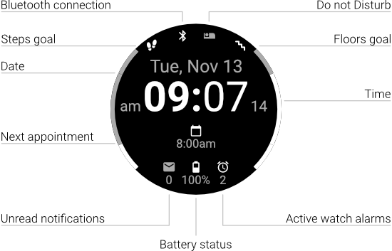

# Facey McWatchface

A watchface for Garmin smartwatches with a focus on communication instead of fitness. Looks something like this:

## Main Feature: Time of Upcoming Appointment

The watchface is able to show the time of the upcoming appointment. Only appointments in the upcoming 24 hours (minus 5 minutes) are displayed. The whole thing only works if a companion app, [Calendar IQ Connector](https://github.com/le-cds/android-calendariq), is installed on an Android mobile the watch is connected to. That app will send information on upcoming appointments to the watch in regular intervals.

## Supported Smartwatches

### Tested

I have either used the watchface myself on the following devices (successfully, I might add), or know of people who have:

* vívoactive® 3 (all variations)

### Untested

The following devices _should_ work:

* Approach® S62
* D2™ Charlie
* D2™ Delta (all variations)
* Darth Vader™
* Descent™ Mk1
* fēnix® 5 (Plus, S Plus, X, X Plus)
* fēnix® 6 (Solar, Dual Power, Pro, Sapphire, Pro Solar, Pro Dual Power, S, S Solar, S Dual Power, S Pro, S Spphire, S Pro Slar, S Pro Dual Power)
* First Avenger
* Forerunner® 245 (Music)
* Forerunner® 645 (Music)
* Forerunner® 745
* Forerunner® 935
* Forerunner® 945
* MARQ™ Adventurer
* MARQ™ Athlete
* MARQ™ Aviator
* MARQ® Captain (American Magic Edition)
* MARQ™ Commander
* MARQ™ Driver
* MARQ™ Expedition
* MARQ™ Golfer
* quatix® 5
* quatix® 6
* tactix® Charlie
* vívoactive® 4

## Attributions

This project stands on the shoulders of the following people:

- The [Crystal](https://apps.garmin.com/en-GB/apps/9fd04d09-8c80-4c81-9257-17cfa0f0081b) watchface ([GitHub repository](https://github.com/warmsound/crystal-face)).
- Eugen Belyakoff from the Noun Project, whose [Steps](https://thenounproject.com/term/steps/87667/) icon is used.
